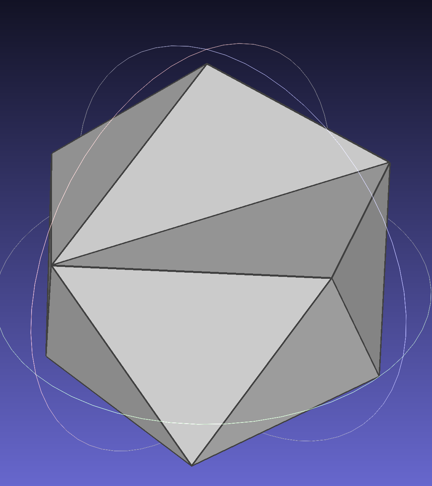

## Mesh Editing Geometry Processing

This project implements low-level manipulations of triangular meshes by Loop Subdivision, Quadric Error Simplification, Isotropic Remeshing, Bilateral Mesh Denoising. This project associates with Brown CSCI 2240 Computer Graphics course and the assignment requirement can be found in ```assignment.md```.

### 3 Loacl Meshing Algorithms Outputs

| Flip Edge | Split Edge | Collapse Edge |
| :---------------------------------------: | :--------------------------------------------------: | :-------------------------------------------------: |
|  |   |  |

### Global Meshing Algorithms Outputs

Run the program with the specified `.ini` config file to compare your output against the reference images. The program should automatically save the output mesh to the `student_outputs/final` folder. Please take a screenshot of the output mesh and place the image in the table below. Do so by placing the screenshot `.png` in the `student_outputs/final` folder and inserting the path in the table.

<!-- - For instance, after running the program with the `subdivide_icosahedron_4.ini` config file, go to and open `student_outputs/final/subdivide_icosahedron_4.obj`. Take a screenshot of the mesh and place the screenshot in the first row of the first table in the column titled `Your Output`.
- The markdown for the row should look something like `| subdivide_icosahedron_4.ini |   |  |`

If you are not using the Qt framework, you may also produce your outputs otherwise so long as the output images show up in the table. In this case, please also describe how your code can be run to reproduce your outputs.

> Qt Creator users: If your program can't find certain files or you aren't seeing your output images appear, make sure to:<br/>
> 1. Set your working directory to the project directory
> 2. Set the command-line argument in Qt Creator to `template_inis/final/<ini_file_name>.ini`

Note that the outputs do **not** need to exactly match the reference outputs. There are several factors that may result in minor differences, especially for certain methods like simplification where equal-cost edges may be handled differently. -->


<!-- Please do not attempt to duplicate the given reference images; we have tools to detect this. -->

| `.ini` File To Produce Output | Expected Output | Your Output |
| :---------------------------------------: | :--------------------------------------------------: | :-------------------------------------------------: | 
| subdivide_icosahedron_4.ini |   |  |
| simplify_sphere_full.ini |   |  |
| simplify_cow.ini |  |  |

Output for Isotropic Remeshing (Note: if you did not implement this you can just skip this part)
| `.ini` File To Produce Output | Input Mesh .png | Remeshed Mesh .png |
| :---------------------------------------: | :--------------------------------------------------: | :-------------------------------------------------: | 
| remesh_bunny.ini (front view) |   |  |
| remesh_bunny.ini (bottom view) |   |  |
| remesh_bunny.ini (front view) |   |  |
| remesh_bunny.ini (bottom view) |   |  |


Output for Bilateral Mesh Denoising (Note: if you did not implement this you can just skip this part)
| `.ini` File To Produce Output | Noisy Mesh .png | Denoised Mesh .png |
| :---------------------------------------: | :--------------------------------------------------: | :-------------------------------------------------: | 
| denoise_bunny.ini |   |  |
| denoise_cow.ini |   |  |


Output for any other Geometry Processing Functions (Note: if you did not implement this you can just skip this part)
| `.ini` File To Produce Output | Before adding noise | Added noise |
| :---------------------------------------: | :--------------------------------------------------: | :-------------------------------------------------: | 
| noise_bunny.ini |   |  |
| noise_bunny.ini |   |  |


### Design Choices

#### Mesh Data Structure 

Describe your mesh data structure here. 

I use halfedge mesh data structure, in which I use thse two structure to represent a halfedge and a vertex
```
struct HalfEdge {
    HalfEdge* twin;
    HalfEdge* next;
    Vertex* vertex;

    HalfEdge() : twin(nullptr), next(nullptr), vertex(nullptr) {}
};

struct Vertex {
    Eigen::Vector3f position;
    HalfEdge* halfEdge;
    
    Vertex(const Eigen::Vector3f& pos) : position(pos), halfEdge(nullptr) {}
};
```
All other mesh elements (e.g., edges, faces) can be straighfowardly represented by the combination use of the above two structs and field operations.

All the halfedges and vertices are stored in 
```
std::list<Vertex> vertices; std::list<HalfEdge> halfEdges;
```
The main reason for choosing the doubly linked list ```std::list<>``` is that updating (especially for insertion and deletion) can be done ast constant time. In addition, when updating the doubly linked list, the addresses of existing list elements remain unchanged, which has advantage over ```std::vector<>```.

#### Mesh Validator

Describe what your mesh validator checks for here. This can be a list.

- Check for exsistence
  - Verify every vertex have a HalfEdge
  - Verify every edge has a 'next'
  - Verify every edge has a 'twin'
  - Verify every edge has a 'vertex'
- Check for consistency
  - Twin HalfEdge Consistency: Verify each half-edge has a twin and that the twin's twin is the original half-edge.
  - Next HalfEdge Consistency: Ensure the next pointer of each half-edge eventually loops back to form a valid face.
  - Validate Face Consistency: Each face has exactly 3 half-edges.
- Check for linkage: Ensure next-twin relations are correct
- Check for Duplicate HalfEdges: Ensure there are no duplicate half-edges (with the same vertex start and end points).
- Check for Isolated Half-Edges
- Check for Vertex Degree and Isolated Vertices
- Manifoldness Verification
- Check for Face Orientation and Consistency

#### Run Time/Efficency 

Describe how you achieved efficient asymptotic running times for your geometry processing functions, including the data structures you used.

##### General approaches:
- Reduce the number of full-passes of the whole half-edges or vertices. I do as many in-place computation as possible when passing thorugh the whole half-edges or vertices.
- Use data structures that support efficient (constant or nlogn) store, update, and lookup (more details discussed below).

##### Data Structures

**For scenarios where no direct value comparions**: When there are no direct value comparisions, I mainly use ```std::unordered_set``` to store, update, and lookup candidate halfedges or vertices. The hashing mechanism of std::unordered_set enables constant average time complexity for insertions, deletions, and lookups. This data structure choice can be found in Loop Subdivision, Isotropic Remeshing, and Bilateral Mesh Denoising.

**For scenarios where have direct value comparions**: When there are direct value comparisions, I mainly use ```std::multiset``` to store, update, and lookup candidate halfedges or vertices. ```std::multiset``` enable building a balanced binary search tree and enable constant time retrieval of the smallest/biggest values. This data structure choice can be found in Quadric Error Simplification abd Isotropic Remeshing.

<!-- ### Collaboration/References

I clarify that there is no collaboration include when I do this project.

References for mathematical formulas are coming from course slides. -->

### Known Bugs

There is no computation bugs.

The parameters of isotropic remeshing and bilateral denoising need to be properly set in order to get good results, since these methods are purely heuristics.
