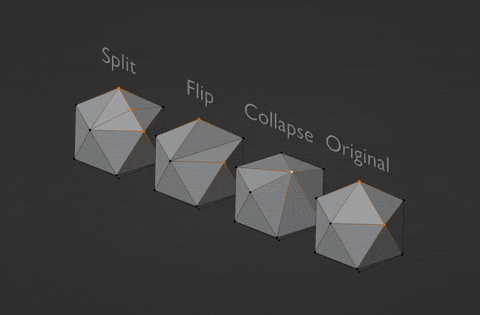

# Assignment 2: Geometry Processing (Mesh)

**Released:** 2/16/24

**Milestone Due:** 2/26/24 @ 11:59pm EST

**Final Assignment Due:** 3/6/24 @ 11:59pm EST

In this assignment, you will gain experience with low-level manipulations of triangular meshes by implementing several geometry processing functions: subdivision, simplification, and one other method of your choice.

Subdivision and simplification are, in a sense, opposites: one increases the resolution of a mesh while the other decreases it. The specific subdivision algorithm you will implement is called **Loop subdivision**; and the specific simplification algorithm is called **quadric error simplification**.

## Relevant Reading

- The lecture slides!
- [Surface Simplification Using Quadric Error Metrics](http://www.cs.cmu.edu/~./garland/quadrics/quadrics.html)
- [A Remeshing Approach to Multiresolution Modeling](http://citeseerx.ist.psu.edu/viewdoc/download?doi=10.1.1.86.7407&rep=rep1&type=pdf)
- [Bilateral Mesh Denoising](http://citeseerx.ist.psu.edu/viewdoc/download?doi=10.1.1.14.1033&rep=rep1&type=pdf)

## Requirements

This assignment is out of **100 points**.

Your program must implement the following features:

- [Mesh data structure and validator](#mesh-data-structure-and-validator) **(10 points - milestone deadline)**
- [Loop subdivision](#loop-subdivision) **(20 points)**
- [Quadric error simplification](#quadric-error-simplification) **(30 points)**
- [Another geometry processing function](#another-geometry-processing-function) **(25 points for correctness; 5 points for efficiency)**
- [Submission template: output images](submission-final.md) **(5 points)**
- [Submission template: *Design Choices, Collaboration, and Known Bugs*](submission-final.md) **(5 points)**

This sums to **100 points**.

### Mesh Data Structure and Validator

> _This must be completed by the milestone deadline (see [Milestone Grading](#milestone-grading))._

For the mesh data structure that you choose to implement (not counting the basic one provided by `tiny_obj_loader`), you must create a function `void validate(const MeshDataStructure &mesh)` which uses `assert` statements to sanity-check the mesh.

You should implement `validate()` **before** implementing any mesh operations, so that you can run it to detect whether your mesh operations are mangling your data structures. Make your `validate()` function as thorough and comprehensive as possible&mdash;doing so will save you a _lot_ of time debugging.

For full credit, your validator must contain at least 10 unique assertions. Make sure to fill out [submission-milestone.md](submission-milestone.md).

### Loop Subdivision

- Correct subdivided triangle connectivity **(7.5 points)**
- Correct subdivided vertex positions **(7.5 points)**
- Runs in linear time in size of mesh **(5 points)**

### Quadric Error Simplification

> Note: you only need to support contraction of vertex pairs connected by an edge, not arbitrary vertex pairs as is done in the paper.

- Correct edge collapse mesh connectivity **(10 points)**
- Correct computation of optimal collapsed vertex position **(7.5 points)**
- Full algorithm for simplification by iterative edge collapse **(7.5 points)**
- Efficiency: constant-time edge collapse, priority queue for managing candidate edges **(5 points)**

  
Tips on efficiency

Since you need to be able to update the costs of candidate edges in the priority queue, an `std::set` may be a better choice of data structure than `std::priority_queue`. We will accept anything implementation that is better than (or equal to) $O(n^2)$ in the worst case. However, it is highly recommended for you to have a $O(nlogn)$ implementation.

### Another Geometry Processing Function

Choose one (or more) of the following:

1. **Isotropic Remeshing**: make a mesh more regular by iteratively applying a set of local mesh operations. See Section 4 of [this paper] (https://www.graphics.rwth-aachen.de/media/papers/remeshing1.pdf), as well as the lecture slides. More precisely, you should:
   - Compute the mean edge length $L$ of the input.
   - Split all edges that are longer than $\frac{4L}{3}$.
   - Collapse all edges that are shorter than $\frac{4L}{5}$.
   - Flip all edges that decrease the total deviation from degree 6.
   - Compute the centroids for all the vertices.
   - Move each vertex in the tangent direction toward its centroid.
   - Include at least 2 pairs of screenshots showing how your code moves vertices positions. 
2. **Bilateral Mesh Denoising**: smooth noisy meshes while preserving important features. See Section 2 of [this paper](https://www.cs.tau.ac.il/~dcor/articles/2003/Bilateral-Mesh-Denoising.pdf), as well as the lecture slides.
   - This method makes use of mesh vertex normals. As described in the paper, a common way to compute a vertex normal is to take the average of the normals of all faces adjacent to a vertex. The mesh data structure you've already built for the first two parts of this assignment should make this easy.
   - To test this method, you'll need to have some noisy input meshes. The easiest way to do this is to add synthetic noise to a clean mesh you already have. A simple technique is to add a random displacement to every vertex along its normal direction.
   - You don't need to deal with volume preservation, though you can if you want. Sections 3.1-3.2 of [this paper](http://multires.caltech.edu/pubs/ImplicitFairing.pdf) describe a simple volume preservation technique.
   - Prepare at least 2 pairs of noisy meshes. We will test them during grading.
3. A learnable method for **denoising** or **subdivision**
   - There are a number of papers that use neural nets to perform these operations (see this paper on [denoising](https://arxiv.org/pdf/1903.04015.pdf) and this paper on [subdivision](https://arxiv.org/pdf/2005.01819.pdf)).
   - Feel free to find other references/papers that implement neural methods of geometry processing
   - Please briefly explain your the method you used, including your dataset, network architecture, loss functions, etc. 
4. Something else! Ask the instructor if you're uncertain whether what you have in mind is too complex/not complex enough.

## Grading

### Milestone Grading

By the milestone deadline, you should have implemented your **mesh data structure** and **mesh validator** as well as filled out [submission-milestone.md](submission-milestone.md). Having these completed by the milestone deadline is the only way to avoid a 5 point deduction, same as with Path's milestone.

We strongly recommend that you also implement your **atomic mesh operations** (edge flip, edge split, edge collapse) by the milestone deadline&mdash;_however, we will not grade for these_. Instead, you may use the `meshes/icosahedron*.obj` files to test your implementation. Your code should be able to produce meshes which look like the following:

### Final Grading

By your final submission, we expect your code to read in a `.ini` config file which should specify the input and output paths for the meshes and paramaters/arguments you are using for each method. See [./template_inis/final/simplify_cow.ini](./template_inis/final/simplify_cow.ini) for example. Feel free to create your own `.ini` files with additional parameters as necessary, **but do not modify the provided .ini files**!

- Possible methods:
  - `subdivide`, `simplify`, `remesh` and `denoise`.
  - Your program should gracefully exit for unimplemented methods. Please document extra options if you implement something else.
- Running your program should not require any modifications to your source code; your program should respond to the parameters in your `.ini` config file. A `.ini` config file should be your only command-line argument.
- Parameter details for each method are documented in the stencil code's main function.
  - For example, we expect `simplify`'s first argument to be the number of faces to remove.

#### How to Run
To set the `.ini` config file as a command line argument in Qt, go to the Projects tab on the left, under Run, under your currently configured kit, click run, and you should have a screen where you can enter command line arguments to run the executable with.

The program will save the processed/modified mesh to the path specified 'outfile' in the config file.

Note: You will need to take screenshots of your output meshes for your final submission. See [submission_final.md](submission_final.md) for more details.

## Resources

The stencil code is quite bare-bones: besides the main function, it provides code to load `.obj` files into a simple mesh representation (a list of vertices and a list of faces) and save that representation back to an `.obj` file. You'll have to implement everything else.

To test your program, you may use the `.obj` files in `/meshes`. You may also use any other 3D models you like.

  
Note about meshes with boundaries

You do not need to support meshes with boundaries for any part of this assignment. That is to say, you can always assume that every edge has two adjacent faces, so you won't have to worry about special-casing for edges on the boundary.

All the meshes provided in the stencil satisfy this property. If you choose to use any other meshes, it will be on you to make sure that this property is satisfied (else, your code might break).

To inspect your input/output meshes, it's worth getting familiar with some sort of 3D modelling software. We suggest using [MeshLab](https://www.meshlab.net/), which is free, lightweight, and provides a ton of useful functionality, including easy conversions between many different 3D file formats. If you're already familiar with another 3D package such as Maya or Blender, those are perfectly fine, too.

## Submission Instructions
You must complete [submission_milestone.md](submission_milestone.md) and [submission_final.md](submission_final.md) by the milestone and final deadlines, respectively. See the instructions in each file.

For the milestone deadline, submit your GitHub repository to the "Mesh (Milestone)" assignment.

For the final deadline, submit your GitHub repository to the "Mesh (Final)" assignment.

## Implementation & Debugging Tips

- This assignment requires that local mesh operations (e.g. edge splits, edge collapses) run in constant time. Before you start coding, spend some time planning out in detail what data structures you will use to make this possible.
  - You can augment the standard triangle adjacency list data structure (i.e. for each face, which vertices does it connect) with a vertex adjacency list (i.e. for each vertex, which faces is it incident to). **Keep in mind**: since this data structure must support constant-time addition and deletion of mesh elements, you won't be able to use linear indices to refer to vertices and faces (since those would need to be globally re-numbered every time an element is added/removed). Use some other form of unique ID to refer to mesh elements.
  - We recommend implementing a half-edge mesh data structure. This is more difficult to get right, but it can be more elegant than the augmented adjacency list and make some operations easier.
- Each local mesh operation requires careful updates to your mesh data structure. To make sure you get these right, it's helpful to plan by drawing diagrams of the operations being applied to simple 2D meshes, with each affected vertex/face clearly labeled.
- Not every edge operation can be applied to every edge—in some cases, edge operations can lead to a manifold mesh becoming non-manifold. You should spend some time thinking about which of the three local edge operations can have this effect, and under what circumstances. Diagramming some simple 2D meshes can also be useful here. Your code should avoid performing operations that would make a manifold mesh become non-manifold!
- You'll want to start with simple meshes for testing/debugging your implementation. To help with this, the starter code repo contains an .obj file for an icosahedron, plus an .obj file for the result of applying each of the local mesh operations (edge flip, edge split, edge collapse) to the first edge in that mesh (i.e. the edge between the first two vertices in the .obj file).
- As always, implement features one by one and debug as you go. A good strategy: verify each of your local mesh operations (flip, split, collapse) is working correctly before moving on to implementing any global operations.
- Use `const` and `assert` wherever possible.
- Use Qt Creator's debugger.
- **REMINDER: Your code will run much faster if you compile in Release mode ;)**

## Credits

Parts of this assignment are based on an assignment developed for CMU 15-462 by Keenan Crane and Kayvon Fatahalian.
