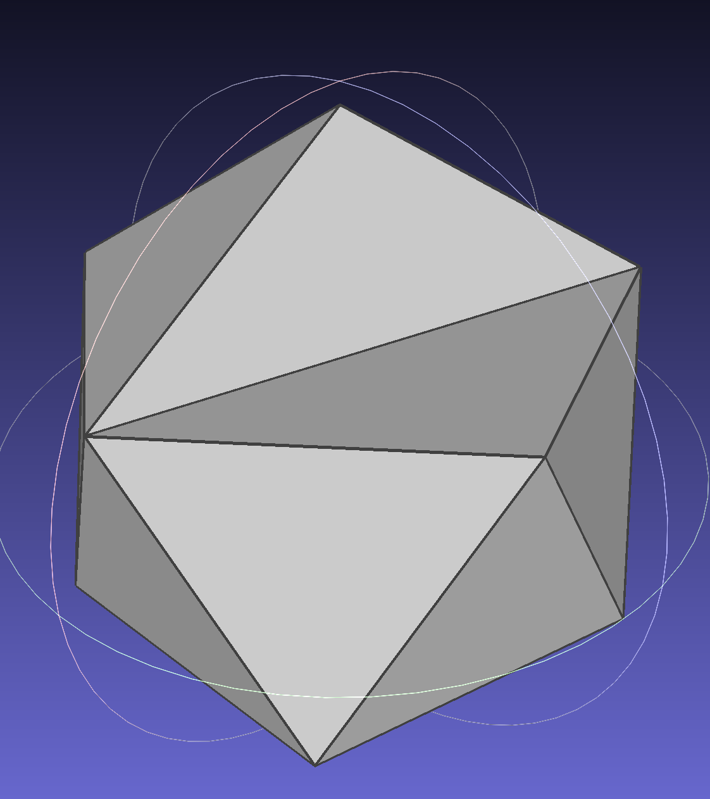
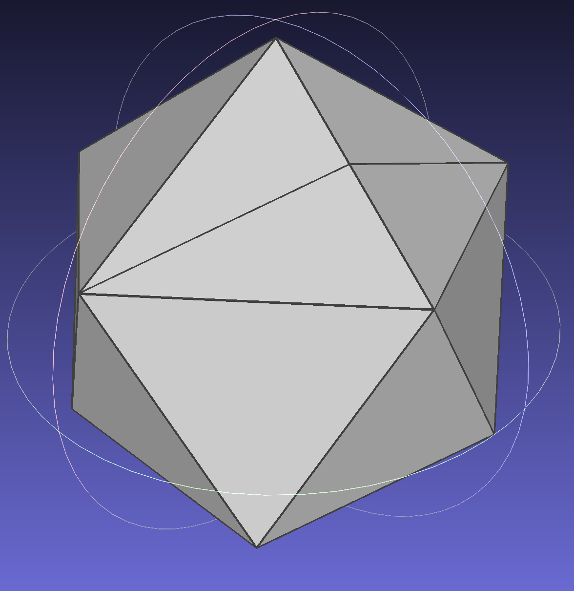
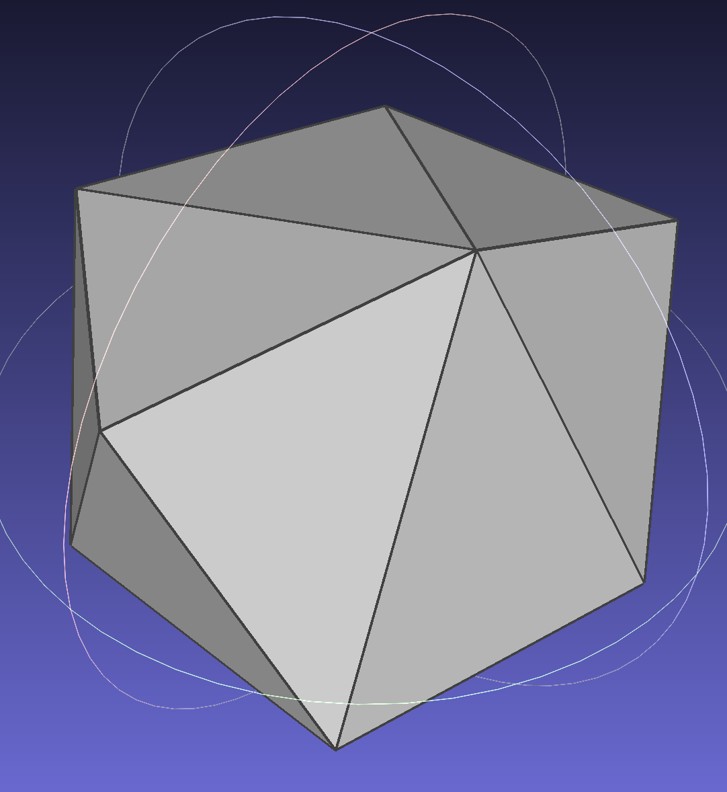

## Mesh (milestone submission)

Please fill this out and submit your work to Gradescope by the milestone deadline.

### Mesh Validator
Describe what your mesh validator checks for here. This can be a list of assertions.

- Check for exsistence
  - Verify every vertex have a HalfEdge
  - Verify every edge has a 'next'
  - Verify every edge has a 'twin'
  - Verify every edge has a 'vertex'
- Check for consistency
  - Twin HalfEdge Consistency: Verify each half-edge has a twin and that the twin's twin is the original half-edge.
  - Next HalfEdge Consistency: Ensure the next pointer of each half-edge eventually loops back to form a valid face.
  - Validate Face Consistency: Each face has exactly 3 half-edges.
- Check for linkage: Ensure next-twin relations are correct
- Check for Duplicate HalfEdges: Ensure there are no duplicate half-edges (with the same vertex start and end points).
- Check for Isolated Half-Edges
- Check for Vertex Degree and Isolated Vertices
- Manifoldness Verification
- Check for Face Orientation and Consistency

### 3 Loacl Operators

| Flip Edge | Split Edge | Collapse Edge |
| :---------------------------------------: | :--------------------------------------------------: | :-------------------------------------------------: |
|  |   |  |

### Collaboration/References

I clarify that there is no collaboration include when I do this project.

References are from lecture slides only.

### Known Bugs

Current no bugs. All of the 3 local operations pass the validation check.
